># สวัสดีครับ วันนี้ผมได้โจทย์ ในการฝึกงาน ให้ทำ CI CD Software life Cicle 💻😊

## ก่อนอื่นเลยเรามาทำความรู้จัก กระบวนการ CI CD ก่อน ละกันว่าคืออะไร

<p align ="center">
  
</p>


> ###### CI/CD คือ กระบวนการหนึ่งที่จะมาช่วยในพัฒนา Software ให้มีประสิทธิภาพมากขึ้น ทั้งในแง่ของระยะเวลาการพัฒนาและคุณภาพของ Software 

##### CI 📁ย่อมาจาก Continuous Integration คือ กระบวนการที่จัดการ Source Code ของเราให้ผ่านกระบวนการการ Testing, Building เพื่อให้แน่ใจว่า Source Code สามารถใช้งานได้จริง

##### CD 📨📦 ย่อมาจาก Continuous Delivery หรือ Continuous Deployment กระบวนการที่ช่วยเหลือให้เราสามารถ Deploy Software ของเราได้อย่างมีประสิทธิภาพ ดยการนำ Source Code ที่ผ่านการ Build และ Testing มาแล้ว  Deploy ขึ้นไปที่ Server
---

>### เมื่อเราได้รู้จักไปเเล้วผมจะเริ่มเข้าเรื่องเลยเเล้วกันครับ 
>-  CI
>-  CD 
---

>## โจทย์ของผมคือ ??
>#### 💬✅สร้างเว็บง่ายๆ เเละ ทำ CI ในการเทส Function เเละ Test Function ที่ไม่ผ่าน ให้ Reject ออกมา ไปจนถึง การ CD คือ Deploy Software ที่พัฒนา อาจจะเป็น Mini Project เเต่ก็เป็นก้าวของการเริ่มต้นที่ดีเลยครับ

### >> 🚀ขั้นตอนเเรกมาเตรียมเครื่องมือกันก่อนดีกว่า Tool Dev
>* เครื่องมือในการทำ เว็บ [ในที่นี้ผมเลือกใช้เป็น Node.js]
  * ทรัพยากรที่ต้องติดตั้ง
    * node.js 
    * express
    ```sh
    npm install express
    ```
    * Github Desktop
>* ไลบรารี่ที่ทำ Automate Testting
  * jest เอะมันคืออะไรนะ ขอขยายความนิดนึงละกัน 
    * jest คือ JavaScript Testing Framework ที่สามารถทำงานได้กับหลาย ๆ โปรเจคไม่ว่าจะเป็น Babel, TypeScript, Node, React, Angular, Vue และอื่น ๆ
    ซึ่งจะสามารถทำ Automate Testing ให้กับฟังก์ชั่นการทำงาน ที่เราเขียน ต่างๆ เเละเจ้าตัว Jest ยังเตรียม Mocking มาให้เราด้วยซึ่งดีมากๆ

---
### 🌐 มาเริ่มต้นโปรเจ็คของเรากันเลย 💨
---
#### 1️⃣ ขั้นตอนเเรก เราจะทำการสร้าง Folder Project ของเรา📁
#### ในที่นี้ เราสร้างเป็น Project_Helloworld (ใคนจะสร้างชื่อะไรเเล้วเเต่ตามสดวกครับ)

  ```sh
    mkdir Project_Helloworld
    cd Project_Helloworld
 ```

#### 2️⃣ เริ่มต้นโปรเจ็กต์ Node.js ด้วยการสร้างไฟล์ `package.json`

   ```sh
    npm init -y
   ```

#### 3️⃣ ติดตั้ง Express:

```sh
    npm install express
```
#### 4️⃣ สร้างไฟล์ index.js เเล้วใส่คำสั่งตามนี้ครับ
```js
const express = require('express');
const app = express();
const port = 3000;

app.get('/', (req, res) => {
  res.send('Hello World!');
});

app.listen(port, () => {
  console.log(`Example app listening at http://localhost:${port}`);
});

```

#### 5️⃣ สร้างไฟล์เป็น index.html เพื่อเทสเว็บของเรา

```html
<!DOCTYPE html>
<html lang="en">
<head>
    <meta charset="UTF-8">
    <meta name="viewport" content="width=device-width, initial-scale=1.0">
    <title>Document</title>
</head>
<body>
    <h1>Hello World</h1>

</body>
</html>
```
#### 6️⃣ มาเทส หน้าเว็บของเรากัน
```sh
    node index.js
```

### 😉 มาละจ้า
<p align ="center">
  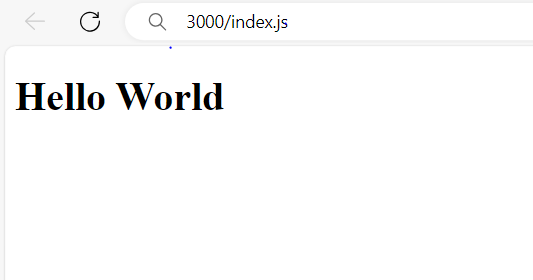
</p>

### ขั้นตอนสำหรับเว็บเราเสร็จเเล้ว
----

>#### 💻📑 ต่อไปเรามาจัดการ Respositories บน github กัน

### 1️⃣ สร้าง Respositories
<p align ="center">
  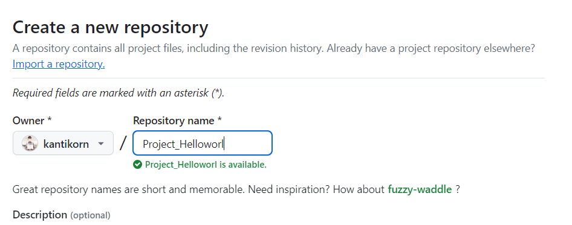
</p>

### เสร็จเเล้วกด Create repository ได้เลยครับ ✅🟩

### 2️⃣ เมื่อสร้างเสร็จ เเล้วจะเเสดง Repo แบบนี้
##### (ในที่นี้ผมสร้างไว้ก่อนเเล้ว ถ้าสร้างใหม่จะมีเเค่ Readme มาเท่านั้นครับ)
<p align ="center">
  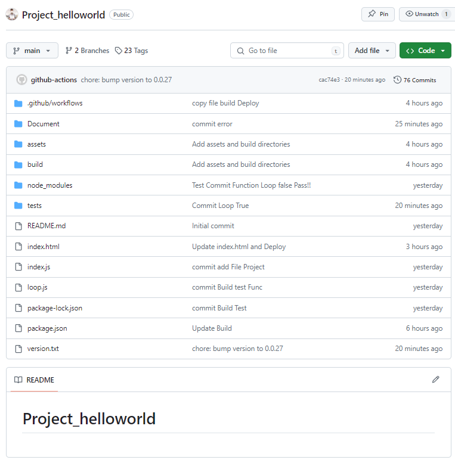
</p>

>### 📉🔽ต่อมาเราจะมา Clone Repositories จาก github ลงมาที่ Github Desktop กันครับ
 
#### 1️⃣ ติดตั้ง Github Desktop ลงเครื่องของเราก่อน
### ลิ้งค์ติดตั้ง Github Desktop https://desktop.github.com/
<p align ="center">
  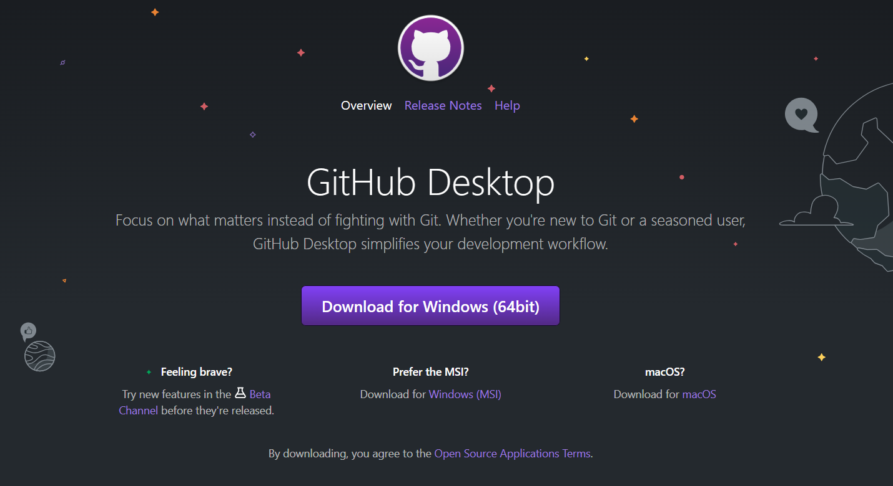
</p>

###  2️⃣ ล็อกอินบัญชีของ github ให้เรียบร้อย เเล้ว กด Clone Repositories จะเด้ง pop up นี้ขึ้นมา 
<p align ="center">
  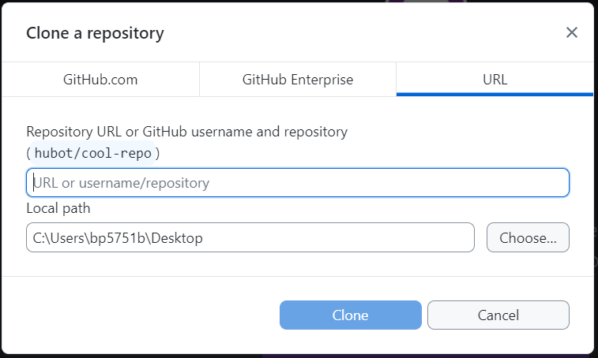
</p>

#### ✅ ให้เราไป Copy URL Respositories บน github Browser โดย Click ที่ Code เเล้ว เลือกเป็น https จากนั้นทำการ Copy
<p align ="center">
  
</p>

### 3️⃣ หลังจาก Copy URL เเล้วนำไปวางที่ Github Desktop เเล้ว จะได้ folder หรือ ไฟล์ ใน Repo ลงมาที่เครื่องของเราเเล้ว เป็นอันเสร็จสิ้นเรื่องการ Connect github เเละ github Desktop📰✅

### 4️⃣ สร้างไฟล์ชื่อ loop.js เพื่อกำหนด ขอบเขตการทำงานของ Function ต้นเเบบ ในการทำเทส


```js
function loopNumbers() {
    let result = [];
    for(let i =1; i <= 10; i++) {
        result.push(i)
    }
    return result;
}
module.exports = loopNumbers;
```


>### 5️⃣ สร้าง Folder tests📂  เเละสร้างไฟล์ loop.test.js 📇( เพื่อส่งค่าไปในฟังก์ชั่นที่เรากำหนดก่อนหน้านี้ )

```js
const loopNumbers = require('../loop');

test('loop from 1 to 10', () =>{
    expect(loopNumbers()).toEqual([1,2,3,4,5,6,7,8,9,10]);
})
```

>#### 🚀 ในการสร้างไฟล์ loop.js เเละ loop.test.js เป็นการสร้าง Function Loop ตัวเลข เเละสามารถส่งค่าไปได้เพียง 10 ค่า เท่านั้น ถ้ามากกว่านี้ การทำ Automate Test จะเเสดง Err !! ถ้าอยู่ในขอบเขต จะสามารถ commit push สำเร็จ

---

>## 📋🔓ต่อไปเข้าสู่การสร้าง WorkFlow สำหรับ CI/CD 

#### สำหรับ CI/CD คือการเขียนสคริปต์หรือไฟล์ที่กำหนดขั้นตอนต่างๆ ที่จะดำเนินการเมื่อมีการเปลี่ยนแปลงโค้ดใน repository ของคุณ

#### 📌สำหรับตัวอย่างนี้ เราจะเน้นไปที่การสร้างไฟล์ Workflow สำหรับ GitHub Actions เพื่อทดสอบ (Test) และนำส่งโค้ด (Deploy) โดยอัตโนมัติ

### ✅งั้นมาลุยกันต่อเลยครับ🚩

### 6️⃣ 📁เราจะสร้าง Folder github เเละ workflows ใน Folder github อีกที รูปเเบบประมาณนี้

  * github
    * workflow

### 7️⃣ 📁ต่อไปทำการสร้างไฟล์ generate-tag.yml โครงสร้าง Folder ประมาณนี้ครับ
* github
    * workflow
        * generate-tag.yml

### 8️⃣ ทำการเขียนโค้ด WorkFlow เพื่อกำหนด การทำ Test CI Automate กัน

```yml
name: Generate Tag

on:
  push:
    branches:
      - main

jobs:
  test_and_create_tag:
    runs-on: ubuntu-latest

    steps:
    - name: Checkout code
      uses: actions/checkout@v2

    - name: Set up Node.js
      uses: actions/setup-node@v2
      with:
        node-version: '14'

    - name: Install dependencies
      run: npm install

    - name: Run tests
      run: npm test

    - name: Set up Git
      if: success()
      run: |
        git config --global user.name 'github-actions'
        git config --global user.email 'github-actions@github.com'

    - name: Get current version
      if: success()
      id: get_version
      run: |
        if [ -f version.txt ]; then
          version=$(cat version.txt)
          echo "Current version: $version"
        else
          version=0.0.0
          echo "0.0.0" > version.txt
          echo "Current version: $version"
        fi
        echo "::set-output name=version::$version"

    - name: Increment version
      if: success()
      id: increment_version
      run: |
        version=${{ steps.get_version.outputs.version }}
        IFS='.' read -r major minor patch <<< "$version"
        patch=$((patch + 1))
        new_version="$major.$minor.$patch"
        echo "New version: $new_version"
        echo "::set-output name=new_version::$new_version"
        echo $new_version > version.txt

    - name: Run tests and check results
      run: |
        result=$(npm test)
        echo "$result"
        if [[ "$result" == *"FAIL"* ]]; then
          echo "Tests failed: There are failing tests. Please check and fix them before continuing."
          exit 1
        else
          echo "Tests passed successfully"
        fi

    - name: Commit new version
      if: success()
      env:
        GITHUB_TOKEN: ${{ secrets.GITHUB_TOKEN }}
      run: |
        git add version.txt
        git commit -m "chore: bump version to ${{ steps.increment_version.outputs.new_version }}"
        git push https://x-access-token:${{ secrets.GITHUB_TOKEN }}@github.com/kantikorn/Project_helloworld.git HEAD:main


    - name: Create new tag
      if: success()
      env:
        GITHUB_TOKEN: ${{ secrets.GITHUB_TOKEN }}
      run: |
        git tag v${{ steps.increment_version.outputs.new_version }}
        git push https://x-access-token:${{ secrets.GITHUB_TOKEN }}@github.com/kantikorn/Project_helloworld.git v${{ steps.increment_version.outputs.new_version }}

    - name: Copy index.html to build directory
      run: cp index.html build/

    - name: Deploy to GitHub Pages
      uses: peaceiris/actions-gh-pages@v3
      with:
          github_token: ${{ secrets.GITHUB_TOKEN }}
          publish_dir: ./build
          html_file: index.html
```

>### ✅เราจะทำการ Test commit ที่ถูกต้องขึ้นไป ที่ github ของเรา ก่อน

### ทำการกำหนดหัวข้อที่ต้องการ commit ขึ้นไปที่ github Browser ในที่นี้ยกตัวอย่างเป็น Commit Loop True

<p align ="center">
  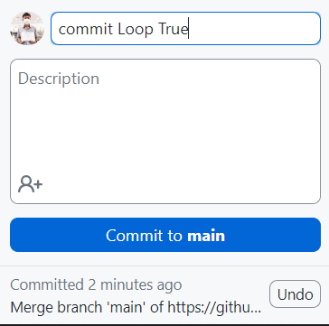
</p>

#### ✅ ถ้าเทสเเล้ว ฟังก์ชั่นที่เราส่งค่าไปถูกต้อง คือ 10 ค่า เพื่อ Loop จะเเสดง การ Commit push Success

<p align ="center">
  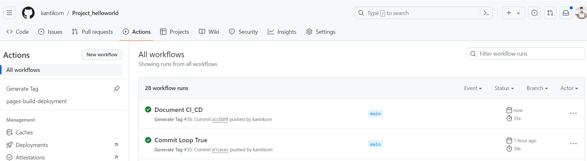
</p>

---
<p align ="center">
  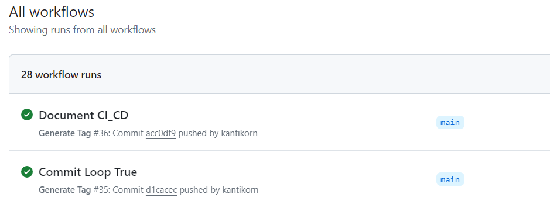
</p>

### สามารถ เข้ามาดู Work Flow ที่เราเขียนกำหนดคำสั่งการทำงาน ว่า ผ่าน ทุก Case ไหม 

<p align ="center">
  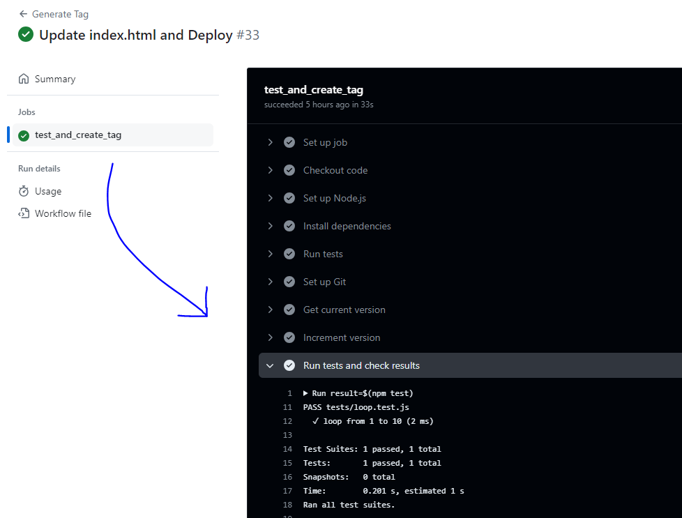
</p>

---

### ❗❌ในกรณีที่ส่งค่า ไม่ผ่านไปยัง function เช่นส่งค่าไป 11 ค่า เเต่ฟังก์ชั่นต้องการ 10 ค่า จะเเสดงผล ไม่ผ่านหลังจาก Commit ไปที่ github Browser

<p align ="center">
  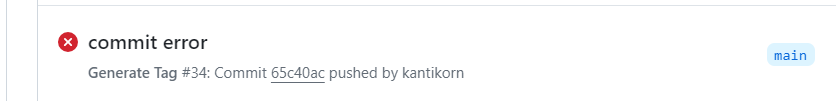
</p>

<p align ="center">
  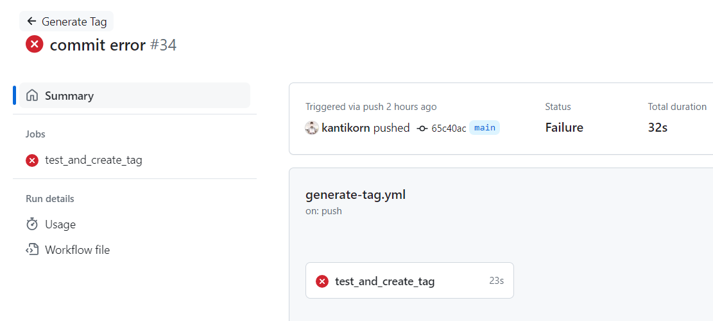
</p>

### ❗⛔สามารถ เข้ามาดู Work Flow Reject Error จะเเสดงข้อผิดพลาดจากการ Run Test

<p align ="center">
  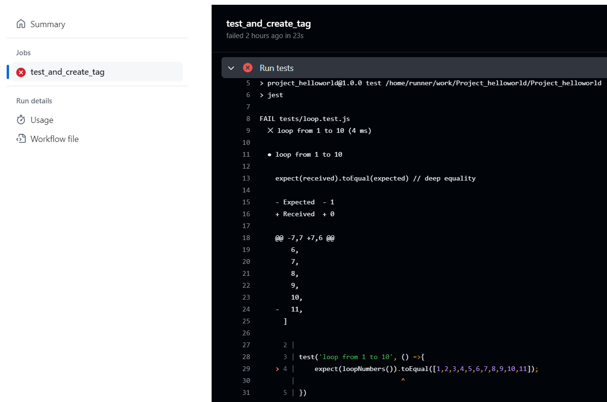
</p>

>### ✅📑ในกรณีที่ Automate Test ผ่านตามเงื่อไข จะทำการ Deploy ขึ้นไปที่ github page ด้วยคำสั่งนี้🚚


```yml
    - name: Deploy to GitHub Pages
      uses: peaceiris/actions-gh-pages@v3
      with:
          github_token: ${{ secrets.GITHUB_TOKEN }}
          publish_dir: ./build
          html_file: index.html
```

<p align ="center">
  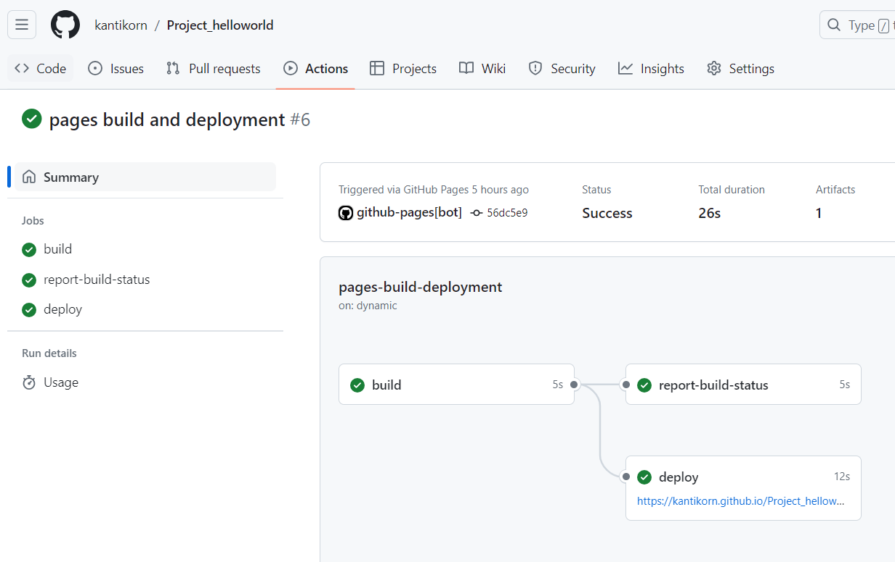
</p>

#### ✅ เเละสามารถ Click ลิ้งค์ deploy เพื่อเเสดงหน้าเว็บที่เรากำหนด ให้เเสดงเป็นหน้าเเรก คือ index.html
<p align ="center">
  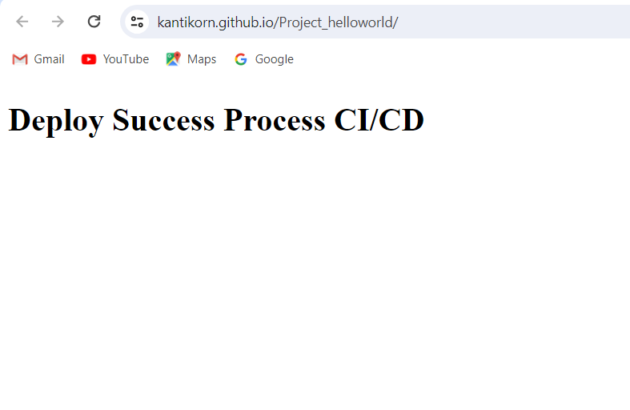
</p>


      


